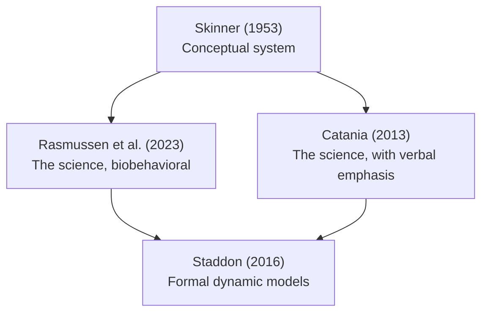

> [!info] License
> © 2026 Tom Donaldson.
> This work is licensed under [CC BY 4.0](https://creativecommons.org/licenses/by/4.0/).
> Third-party figures and quotations retain their original licenses.
> 
---

# Concepts

Went looking for introductory material for three potential audiences. The prompt (to Claude.ai):

>`What book would make the best introduction to the science of behavior (that is Behavior Analysis), for an undergraduate student in psychology, neuroscience, and computer science?`
`

The selection seemed reasonable, so I asked for a summary of each. Skinner's *Science and Human Behavior* is the only one I have read, and seems most fundamental (and is an easy read). So: I reordered Claude's list to put Skinner first pending my reading of Rasmussen, et al.

I ***will*** read the others, update the summaries below, and create reference notes (annotations) linked from the reference list. 

Hmmm, will probably link the ref notes from here in place of the inline text. Also, I may check out some of my old-timey favorites from Skinner. Somewhere along the way also need to include research strategy/tactics books such as [Sidman's](../References.md#sidman-1960) and [Johnston & Pennypackers's](../References.md#johnston-pennypacker-2008)

Yes, I tend to favor the old stuff. Couple of reason's. First, I have been working as a software developer since 1982 and have not really kept up with behavior analysis. Second: I'm old.

### Summaries

## 1. [Skinner, _Science and Human Behavior_ (1953)](../References.md#skinner-1953)

This book sets out the conceptual system of radical behaviorism and applies it to human affairs. It reports no new experiments. It is in six sections:

1. **Whether a science of behavior is possible.** Skinner rejects explanatory fictions and inner causes.
2. **The analysis of behavior.** Reflexes, operant behavior, shaping, discrimination, schedules, emotion, aversive control, and punishment.
3. **The individual as a whole.** Self-control, thinking, private events, and the self, all treated as behavior.
4. **Behavior of people in groups.** Social behavior, and how people control one another and how groups control their members.
5. **Controlling agencies.** Government and law, religion, psychotherapy, economics, and education, each analyzed as a set of contingencies.
6. **The control of human behavior.** Culture as a body of contingencies, and the deliberate design of cultures.

This book is the source of the philosophy that the other three assume.

## 2. [Rasmussen, Clay, Pierce, & Cheney, _Behavior Analysis and Learning: A Biobehavioral Approach_, 7th ed. (2023)](../References.md#rasmussen-clay-pierce-cheney-2022)

This is a survey of the experimental analysis of behavior, written from a consistently Skinnerian position. It moves from basic processes to complex human behavior.

- **Foundations.** The science of behavior, research methods, and single-subject experimental design.
- **Respondent behavior.** Reflexes, respondent conditioning, and their biological basis.
- **Operant behavior.** Reinforcement, extinction, schedules of reinforcement, and aversive control.
- **Interactions.** How operant and respondent processes relate, including biological constraints.
- **Stimulus control.** Discrimination, generalization, and conditioned reinforcement.
- **Choice.** The matching law and behavioral economics.
- **Complex behavior.** Imitation, rule-governed behavior, and verbal behavior.
- **Application and synthesis.** Applied behavior analysis, then selection at three levels: phylogenetic, ontogenetic, and cultural.

Neuroscience and epigenetics appear throughout the book rather than in one chapter.

## 3. [Catania, _Learning_, 5th ed. (2013)](../References.md#catania-2013)

This text is organized by whether the behavior involves language.

- **Behavior without learning.** Elicited behavior, releasers, and the evolutionary background of behavior.
- **Learning without words.** Operant and respondent processes, stimulus control, aversive control, and schedules. Most of the evidence comes from animal experiments.
- **Learning with words.** Verbal behavior, instructional control, and how verbal behavior governs nonverbal behavior.
- **Remembering.** Memory treated as behavior.

It cites the primary literature heavily and quotes historical sources at length. Its main strength is precise definition of terms.

## 4. [Staddon, _Adaptive Behavior and Learning_, 2nd ed. (2016)](../References.md#staddon-2016)

This book builds formal, dynamic models of behavior. Staddon calls his position "theoretical behaviorism." He accepts behaviorism's focus on the environment but rejects Skinner's opposition to theory. His models use internal state variables, though not cognitive constructs.

- **Methods.** Dynamic systems, feedback, and optimality analysis.
- **Simple systems.** Kinesis, reflexes, and habituation, including his multiple-time-scale habituation model.
- **Regulation.** Feeding and motivation, modeled as feedback processes.
- **Choice.** Matching, maximizing, and behavioral economics, compared against the data.
- **Timing.** Interval timing, including a critique of scalar expectancy theory.
- **Learning.** Models of classical conditioning, operant learning, and spatial search.

The text is mathematical, and each model can be turned into code.

## How they relate

---

- Previous: [01 - Project Background](./01%20-%20Project%20Background.md)
- Next: [03 - Behavioral Neuroscience](./03%20-%20Behavioral%20Neuroscience.md)

---
[References](../References.md)
